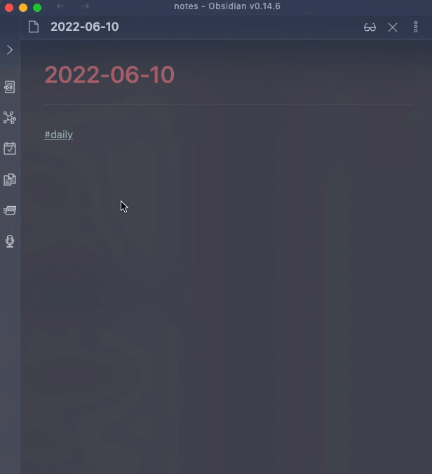

# Events Info



## Command Input

The input is a date in `YYYY-MM-DD` format, for example `2022-06-20`

When nothing has been input yet, the following criteria will be applied as default (in order):

- if some text is selected AND that text matches the format above, use that as default
- if the filename matches the format, use that as default. this is useful in conjunction with daily notes that have a format of "YYYY-MM-DD"
- if neither of the above two match, use today as a default

## Template

### Default Template

```markdown
### {{summary}}

* {{start}}-{{end}}: [Link]({{link}})
* organizer {{organizer}}
* {{attendees}}
* {{location}}

{{attachments}}

{{conference}}
```

The content above will be inserted for a selected event. To customize, create a new template in a file and reference that file in the plugin settings.

### Template Fields

Fields are variables enclosed in `{{` `}}` and will be replaced when the content is generated.

| Field          | Description                                                                                                                                                             |
| -------------- | ----------------------------------------------------------------------------------------------------------------------------------------------------------------------- |
| id             | The event ID                                                                                                                                                            |
| recurringId    | The recurring event ID                                                                                                                                                  |
| summary        | Event title                                                                                                                                                             |
| description    | Event description                                                                                                                                                       |
| status         | The event status (e.g. confirmed, tentative, cancelled)                                                                                                                 |
| eventType      | The event type (e.g. default, focusTime)                                                                                                                                |
| start          | The event start time                                                                                                                                                    |
| end            | The event end time                                                                                                                                                      |
| link           | This will produce a link to the Google calendar event. Useful to reference attachment in the event or other event info                                                  |
| organizer      | The email of the event organizer                                                                                                                                        |
| attendees      | Email(s) of all attendees, joined by `,`. If the attendee had declined the event, a `(x)` will appear near their email. A tentative response will have a `(?)` appended |
| attendees.name | Similar to `attendees` but will replace the email with the name of the attendee. If the name is not available for an attendee, the email is returned instead.           |
| location       | The event location                                                                                                                                                      |
| attachments    | A list of attachments for the event, formatted as markdown links.                                                                                                       |
| conference     | A list of conference entry points for the event, formatted as markdown links.                                                                                           |
| conference.solution | The name of the conference solution (e.g. Google Meet).                                                                                                             |
| source         | will return the google account from where this event was fetched                                                                                                        |
| json           | returns the entire event object as JSON. this is useful when used with other templating plugins. [see example](/obsidian-google-lookup/person/#using-templater).        |

### Customizing Template

You can create your own template in a file, and include a link to that file in Settings for `Event Template`. For example, you can create a note in `_assets/templates/` called `t_event` and then provide the path `_assets/templates/t_event` in Settings

## Notes

The plugin will only query the primary calendar of the logged in user.
