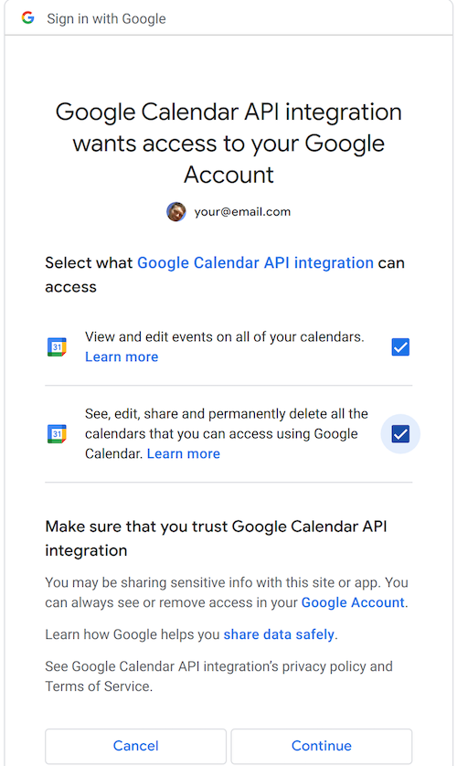

# Google Client Setup

The first step to using the plugin is getting set up with Google credentials that the application case use.

## Instructions

- [Create Google Cloud Project](https://console.cloud.google.com/projectcreate?). The name of the project doesn't matter.
- [Activate Google People API](https://console.cloud.google.com/apis/api/people.googleapis.com)
- [Activate Google Calendar API](https://console.cloud.google.com/apis/api/calendar-json.googleapis.com)

> You should now see `People API` and `Google Calendar API` listed in the [API dashbooard](https://console.cloud.google.com/apis/dashboard) of your project. At this point, your project is set up to use those APIs. Now on to creating a client that the application can use.

- [Configure OAUTH screen](https://console.cloud.google.com/apis/credentials/consent?)

  - The type of the application should be `External` (unless you are building it for users of your Google domain only)
  - When asked for the Scopes, you should have the following:

    - .../auth/calendar.calendarlist.readonly
    - .../auth/userinfo.profile
    - .../auth/calendar.readonly
    - .../auth/calendar.calendars.readonly
    - .../auth/calendar.events.readonly
    - .../auth/contacts.readonly
    - .../auth/contacts.other.readonly
    - .../auth/directory.readonly
    - .../auth/profile.emails.read

  - Add Test users as needed

- Go to the [Credentials screen](https://console.cloud.google.com/apis/credentials) of the project and create a `OAuth Client ID` using the Create Credentials dropdown. Choose `Desktop App` as type

- The credentials you created will show you a `Client_ID` and `Client_Secret`. Copy those and paste them into their corresponding fields in the plugin settings

If you followed the instructions correctly, you should be done with the Google setup. The next time you add an account in the plugin settings screen, you will be asked to allow the Google app you just created to facilitate the query of your data.

## Why is this needed?

There are two components to using the Google API:

1. API Client identification
1. User authorization

The second part is the OAuth2 flow you've likely seen in many applications.

The first part is what identifies the application facilitating the request, not the actual end user. Normally in web applications, the identification tokens for the application are in a backend and not visibile publically. Similarly, with desktop applications, the credentials might be included and obfuscated in the code such that they are not publically readable. In this case, the application is open source, and Google Terms for the API use do require that the credentials be treated as secret/private.

If anyone knows of a way to include client credentials in an open source app in a compliant manner, please reach out! Otherwise, for now, the usage of the plugin will require users to do their own Google setup.
