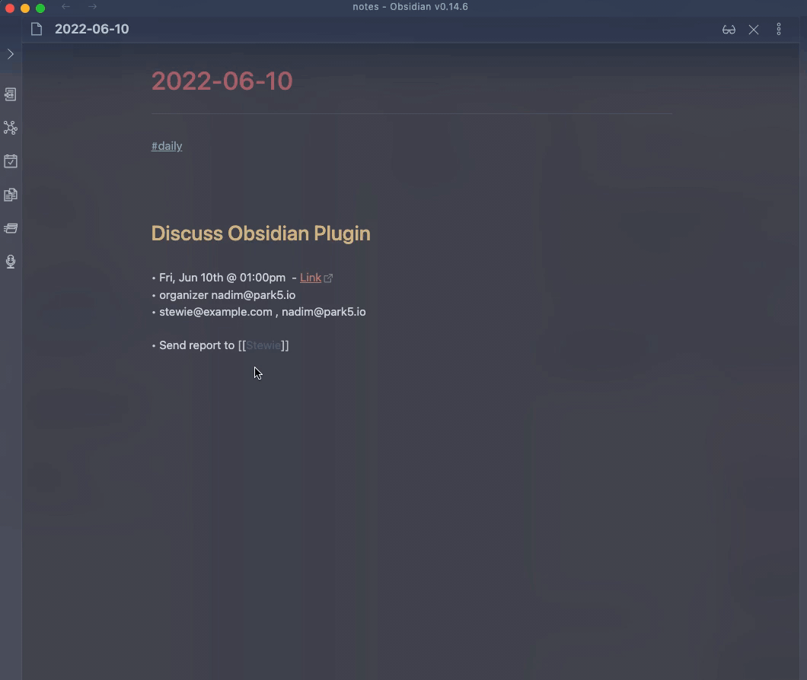
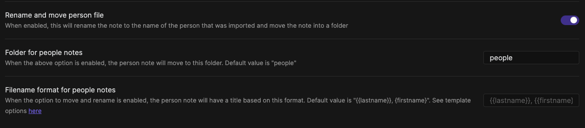

# People Info



## Command Input

The input is a string search against Google Contacts. Anything that Google Contacts accepts as a query parameter will be supported. First/Last names, emails...etc

When nothing has been input yet, the following criteria will be applied as default (in order):

- if some text is selected use that as a default query
- use the filename as a default query

### Move/Rename

If the option to move/rename the note is enabled (default is enabled), after the content from the person template is inserted:

- the note will be renamed according to the `filename format` option. the default here is `{{lastname}}, {{firstname}}`. Any field in the template fields listed below can be used
- the note will be moved to the directory specified in Settings. By default, this is blank which means the file would be renamed but will not be moved to any other directory

> If the first option below `Rename and move person file` is not enabled, the other two settings have no effect.

> When specifying your own filename format, make sure you pick something that continues to be unique across several contacts. i.e. picking `{{firstname}}` is valid, but obviously will not work out well if you have two contacts with the same first name.

> If you specify a directory to move the contact file to, make sure that directory exists!



## Template

### Default Template

```
---
aliases: ["{{lastfirst}}", "{{firstlast}}", "{{firstname}}.{{lastname}}", {{emails}}]
created: ["{{date}} {{time}}"]
---
# {{firstname}} {{lastname}}
#person #person/{{source}}

{{org.title}} {{org.department}}

----

## Contact Info

Email: {{emails}}
Phone: {{phones}}

[open in Google Contacts]({{link}})

{{primaryPhoto}}

----

## Log

### [[{{date}}]] {{time}} - Created
```

The intention with this default template is to be used to create a new note rather than inserting into an existing one, although that can be customized by changing the template.

### Template Fields

Fields are variables enclosed in `{{` `}}` and will be replaced when the content is generated.

| Field          | Description                                                                                                                                                                                                    |
| -------------- | -------------------------------------------------------------------------------------------------------------------------------------------------------------------------------------------------------------- |
| firstName      |                                                                                                                                                                                                                |
| lastName       |                                                                                                                                                                                                                |
| middleName     |                                                                                                                                                                                                                |
| firstLast      | "Firstname Lastname" ex: `Stewie Griffin`                                                                                                                                                                      |
| lastFirst      | "Lastname, First" ex: `Griffin, Stewie`                                                                                                                                                                        |
| nicknames      | Nicknames, joined by `, `                                                                                                                                                                                      |
| contactGroups  | contact groups from Google (ex: `myContacts`, `Starred`), joined by `, `                                                                                                                                       |
| emails         | Email(s), joined by `,`                                                                                                                                                                                        |
| phones         | Phone number(s), joined by `,`                                                                                                                                                                                 |
| addresses      | Address(es). The different fields in the address are joined by `,` and each address will be on a new line.                                                                                                     |
| birthdays      | birthday(s) stored for the contact in year-month-day format, joined by `,`                                                                                                                                     |
| org.title      | Title of contact in company directory (if applicable)                                                                                                                                                          |
| org.department | Person's department in company directory (if applicable)                                                                                                                                                       |
| org.name       | Name of the organization/company (if applicable)                                                                                                                                                               |
| type           | Passed along from Google API. Possible values [here](https://developers.google.com/people/api/rest/v1/people#Person.SourceType). Useful to differentiate a contact vs. someone obtained from company directory |
| source         | will return the google account from where this event was fetched                                                                                                                                               |
| urls           | urls for that contact; includes things like homepage. will be returned as a comma separated string of `type: value`. For example, `homepage: https://www.obsidian.md`                                          |
| relations      | relations for the contact. will be returned as a comma separated string of `type: person`. For example, `spouse: Jack`                                                                                         |
| clientData     | client key/value pairs. will be returned as a comma separated string of `key: value`.                                                                                                                          |
| userData       | user defined key/value pairs. will be returned similar to `clientData`                                                                                                                                         |
| bio            | the contact's bio; in Google Contacts, that field is called `Notes`                                                                                                                                            |
| link           | will return the url, if available, to open the contact on Google Contacts                                                                                                                                      |
| photos         | profile photos for that contact. will be returned as a space separated markdown image links. For example, ` `                |
| primaryPhoto   | primary (based on Google sources) profile photo for that contact. will be returned as markdown image link. For example, ``                                                |
| json           | returns the entire contact object as JSON. this is useful when used with other templating plugins. [see example below](#using-templater).                                                                      |

### Customizing Template

You can create your own template in a file, and include a link to that file in Settings for `Event Template`. For example, you can create a note in `_assets/templates/` called `t_event` and then provide the path `_assets/templates/t_event` in Settings

### Using Templater

You can use the `json` field to get more flexibility with how the info is rendered in your template. This would typically be done with another templates plugin, such as [Templater](https://silentvoid13.github.io/Templater/).

```
<%*
 let json = {{json}}
 let firstName = json.firstName
 let emails = json.emails.join("\n")
 let relations = json.relations.map(({person, type}) => `${firstName} is a ${type || ''} relation to ${person}`).join("\n")
 -%>

 my contact's first name is <% firstName %>
 emails:
 <% emails %>

 relations:
 <% relations %>

 date: <% tp.file.creation_date("YYYY-MM-DD HH:mm:ss") %>

<% tp.file.cursor() %>
```

The first line brings in the entire object into the `json` variable. From there, you can construct any template for each individual field. When the above Templater snippet is run, it would output something similar to this:

```
 my contact's first name is Stewie
 emails:
 stewie.griffin@baby.example.com
 stewie@baby.genius.example.com

 relations:
 Stewie is a child relation to Lois
 Stewie is a brother relation to Brian

 date: 2022-10-26 14:57:22
```
